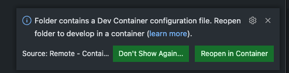

# Compiling and Optimizing a Model with TVMC


## Getting Started

### [Install TVM](https://tvm.apache.org/docs/install/index.html) from source for Ubuntu 20.04

_Installing from source gives you the maximum flexibility to configure the build effectively from the official source releases._

1. Clone the repository 
```bash
git clone --recursive https://github.com/apache/tvm tvm
```
2. make sure all packages are installed and up to date
```bash
sudo apt-get update
sudo apt-get install -y python3 python3-dev python3-setuptools gcc libtinfo-dev zlib1g-dev build-essential cmake libedit-dev libxml2-dev
```
3. check that `cmake` is installed
```bash
cmake --version
cmake version 3.16.3
```
4. create a `build` directory, copy the `cmake/config.cmake` to the directory.
```bash
cd tvm
mkdir build
cp cmake/config.cmake build
```
5. For CPU download LLVM
```bash
wget https://github.com/llvm/llvm-project/releases/download/llvmorg-13.0.0/clang+llvm-13.0.0-x86_64-linux-gnu-ubuntu-20.04.tar.xz
tar xf clang+llvm-13.0.0-x86_64-linux-gnu-ubuntu-20.04.tar.xz
```
6. Adjust `config.make` to fit your requirements. See more [here](https://tvm.apache.org/docs/install/from_source.html#:~:text=Edit%20build/config.cmake%20to%20customize%20the%20compilation%20options)

In this example, since I ll use PyTorch and CPU and enabled. 
```bash
set(USE_LLVM "/home/ubuntu/tvm/clang+llvm-13.0.0-x86_64-linux-gnu-ubuntu-20.04/bin/llvm-config --link-static")
# added additionally
set(HIDE_PRIVATE_SYMBOLS ON)
```
7. Build tvm and related libraries. (takes around ~30-40min)
```bash
cd build
cmake ..
make -j4
```

8. Install [Python Package](https://tvm.apache.org/docs/install/from_source.html#python-package-installation)
```bash
cd python; python3 setup.py install --user; cd ..
```
9. Install additional Python dependencies
```bash
pip3 install --user numpy decorator attrs tornado psutil xgboost cloudpickle tornado Pillow
```

10. test everything works
```bash
# check that everything is installed
tvmc --help
# download sample onnx model
wget https://github.com/onnx/models/raw/master/vision/classification/resnet/model/resnet50-v2-7.onnx
# compile model to tvm
tvmc compile \
--target "llvm" \
--output resnet50-v2-7-tvm.tar \
resnet50-v2-7.onnx
# create sample inputs
python3 scripts/create_sample_inputs_for_resnet.py
# run prediction
tvmc run \
--inputs imagenet_cat.npz \
--output predictions.npz \
resnet50-v2-7-tvm.tar
python3 scripts/create_sample_outputs_for_resnet.py
rm imagenet_cat.npz predictions.npz resnet50-v2-7-tvm.tar resnet50-v2-7.onnx
```

### [Install & working with TVM](https://tvm.apache.org/docs/install/docker.html) and Docker Images (easier)

I created `Dockerfiles` based on [OctoML TVM Container](https://github.com/octoml/public-tvm-docker) containers. The Container exposes two `build-args`. One for the `tvm` version called `TVM_HASH`, default is currently `v0.8.0` and one for `llvm`, default is currently `13`

1. build container
```bash
docker build -t tvm_cpu -f docker/Dockerfile.cpu .
```
2. run container
```bash
docker run -t -i tvm_cpu 
```

#### Alternatively if you are using VSCode you can leverage [`Dev Container`](https://code.visualstudio.com/docs/remote/containers)

The Visual Studio Code Remote - Containers extension lets you use a Docker container as a full-featured development environment. It allows you to open any folder inside (or mounted into) a container and take advantage of Visual Studio Code's full feature set.

You can either use the [devcontainer-cli](https://code.visualstudio.com/docs/remote/devcontainer-cli) or just run in the command palette "reopen in devcontainer" or click on the button of the pop up.




### Instal TVM using OctoMLs [`tvm-build`](https://github.com/octoml/tvm-build) rust library

0. make sure you have the rust toolchain set up

1. install tvm-build
```bash
cargo install tvm-build
```


### Installing the [TVM Runtime only for running predictions](https://tvm.apache.org/docs/how_to/deploy/index.html#deploy-and-integration)

TODO:


## Resources

* [Apache TVM Repository](https://github.com/apache/tvm)
* [BERT Pytorch](https://github.com/t-vi/pytorch-tvmisc/tree/master/transformers-pytorch-tvm/)
* [Sparse a BERT Model](https://github.com/apache/tvm/blob/main/gallery/how_to/deploy_models/deploy_sparse.py)
* [OctoML TVM Container](https://github.com/octoml/public-tvm-docker)
* [OctoML TVM Build Rust CLI](https://github.com/octoml/tvm-build)
* [BERT Test](https://github.com/masahi/torchscript-to-tvm/blob/master/transformers/test_bert.py)